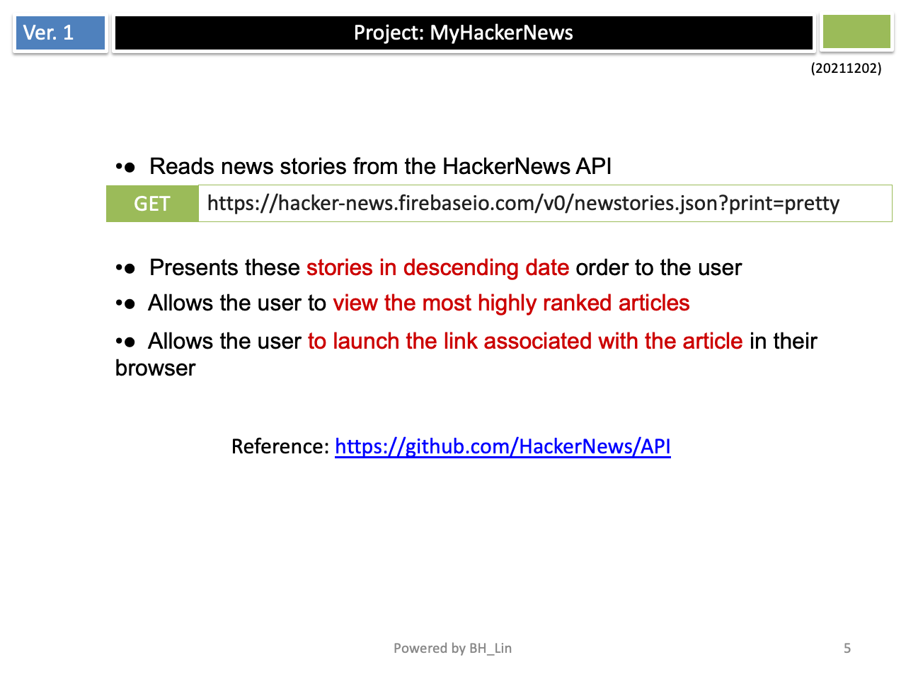

  
Simple File Storage Server
================================================

This is a simple hackerNews application for listing new stories.

## The main components that need to be completed

## API to Get New Stories

## API to fetch Item

## Illustration

## Demo 

## How to Run the Test
Threre are 3 files in project. 
- ./myhackernewsTests/myhackernewsTests.swift
  - testFetchItem
- ./myhackernewsUITests/myhackernewsUITests.swift  
  - testLoadingItems
- ./myhackernewsUITests/myhackernewsUITestsLaunchTests.swift  
  - testLaunch
