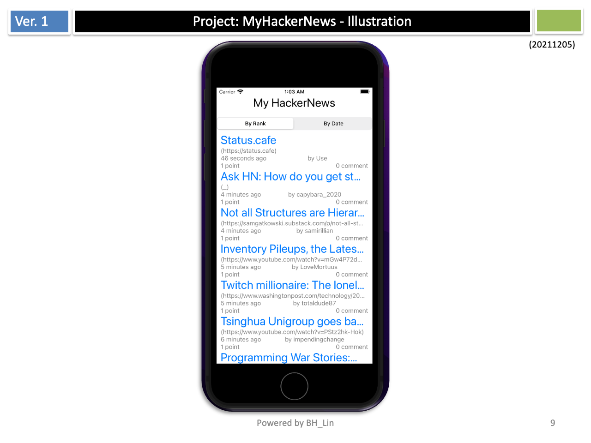
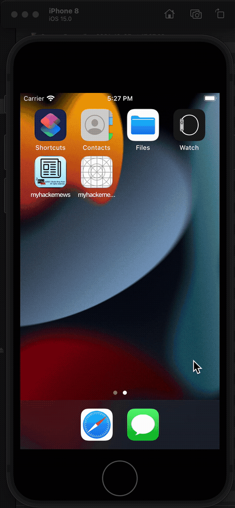

  
My Hacker News
================================================

This is a simple hacker news iOS application for listing new stories.  
The app is built with SwiftUI.  
Data source for the project is from "https://github.com/HackerNews/API"

## Table of Contents
<!-- START doctoc generated TOC please keep comment here to allow auto update -->
<!-- DON'T EDIT THIS SECTION, INSTEAD RE-RUN doctoc TO UPDATE -->
- [My Hacker News](#my-hacker-news)
  - [Table of Contents](#table-of-contents)
  - [Features:](#features)
  - [The main components](#the-main-components)
  - [API to Get New Stories](#api-to-get-new-stories)
  - [API to fetch Item](#api-to-fetch-item)
  - [Illustration](#illustration)
  - [Demo](#demo)
  - [How to build the app](#how-to-build-the-app)
  - [How to Run Test](#how-to-run-test)
<!-- END doctoc generated TOC please keep comment here to allow auto update -->

## Features:
- Users can read news from the HackerNews application.
- The app presents these stories to users in descending order.  
- It allows users to view the highest ranked articles.  
- The user can start the link associated with the article in the browser.  

## The main components

## API to Get New Stories

## API to fetch Item

## Illustration

## Demo 


## How to build the app
- Open myhackernews.xcodeproj via XCode
- Press the start button to build and run the app


## How to Run Test
```shell 
xcodebuild test  -scheme 'myhackernews' -destination 'platform=iOS Simulator,name=iPhone 8,OS=15.0'
```
Related files in project. 
- ./myhackernewsTests/myhackernewsTests.swift
  - testFetchItem
  - testFetchItems
  - testFetchStories
- ./myhackernewsUITests/myhackernewsUITests.swift  
  - testLoadingItems
- ./myhackernewsUITests/myhackernewsUITestsLaunchTests.swift  
  - testLaunch


