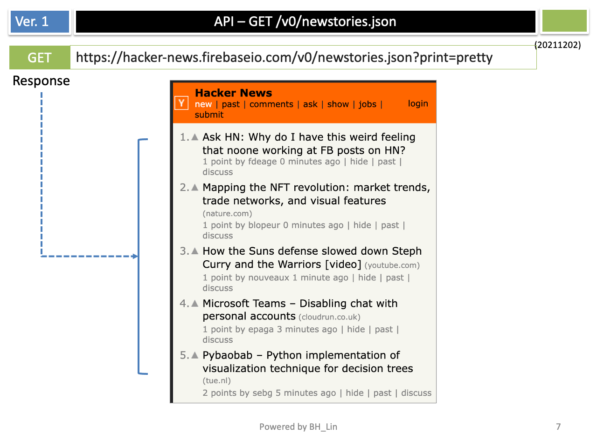

  
Simple File Storage Server
================================================

This is a simple hacker news iOS application for listing new stories.  
The data source for the project is from "https://github.com/HackerNews/API"

## Features:
- Users can read news from the HackerNews application.
- The app presents these stories to users in descending order.  
- It allows users to view the highest ranked articles.  
- The user can start the link associated with the article in the browser.  

## The main components

## API to Get New Stories

## API to fetch Item

## Illustration

## Demo 

## Test Cases
Threre are 3 files in project. 
- ./myhackernewsTests/myhackernewsTests.swift
  - testFetchItem
- ./myhackernewsUITests/myhackernewsUITests.swift  
  - testLoadingItems
- ./myhackernewsUITests/myhackernewsUITestsLaunchTests.swift  
  - testLaunch
